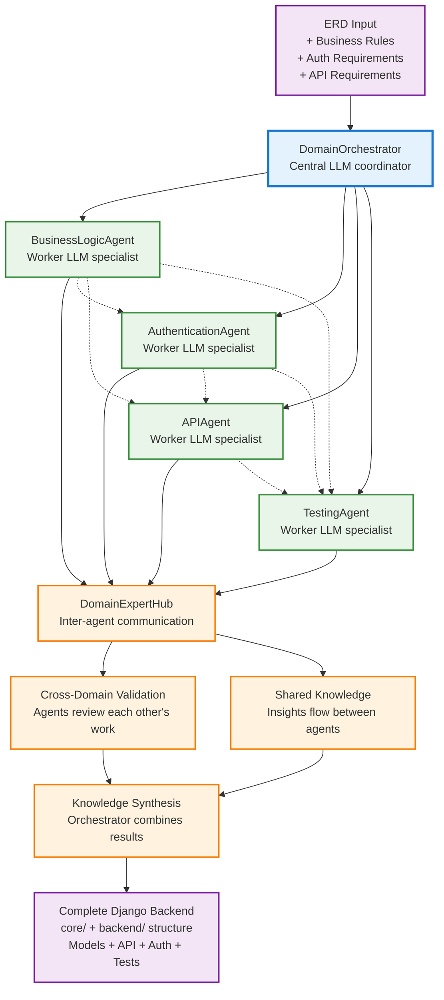

# Django Multi-Agent Backend Generator

**Generate production-ready Django backends from ERD files using specialized AI agents.**

Takes your ERD JSON → **4 AI Domain Experts** collaborate → Complete Django project with **proper structure**

## Multi-Agent AI System

Our **Orchestrator-workers** pattern uses 4 specialized domain expert agents:

| Agent | Domain | Capabilities |
|-------|--------|-------------|
| **BusinessLogicAgent** | Business Rules & Validation | Custom model methods, validation rules, business logic patterns |
| **AuthenticationAgent** | Auth & Permissions | JWT, OAuth, role-based access, permission classes |
| **APIAgent** | REST/GraphQL APIs | DRF ViewSets, pagination, filtering, custom endpoints |
| **TestingAgent** | Test Generation | Unit tests, API tests, factories, comprehensive coverage |

## What You Get

- **Proper Django Structure** - Separate `core/` project config and `backend/` app  
- **Production Ready** - Settings, WSGI, ASGI, migrations, admin interface  
- **REST API** - Django REST Framework with ViewSets, serializers, pagination  
- **JWT Authentication** - Complete auth system with roles and permissions  
- **Comprehensive Tests** - Unit tests, API tests, factories with 80%+ coverage  
- **Business Logic** - Custom validation, model methods, business rules  
- **API Extensions** - Advanced filtering, search, custom actions  

---

## Quick Start

### **1. Install Dependencies**
```bash
pip install django djangorestframework djangorestframework-simplejwt
pip install django-filter factory-boy pytest pytest-django coverage
pip install openai python-dotenv  # For AI generation
```

### **2. Set OpenRouter API Key (Optional)**
```bash
# Create .env file
echo "OPENROUTER_API_KEY=your_key_here" > .env

# Or set environment variable
export OPENROUTER_API_KEY="your_key_here"
```

### **3. Generate Django Backend**
```bash
# Basic usage
python generate_django_backend.py --erd sample_erd.json

# Custom output directory
python generate_django_backend.py --erd my_project.json --output ./my_backend/

# Get help
python generate_django_backend.py --help
```

**That's it!** You'll get a complete Django project with proper structure.

---

## Generated Project Structure

```
my_backend/                      # Project root
├── manage.py                   # Django management script
├── requirements.txt            # All dependencies (8 packages)
├── README.md                   # Setup instructions
├── core/                       # Django project configuration
│   ├── __init__.py
│   ├── settings.py             # Complete Django settings
│   ├── urls.py                 # Main URL configuration
│   ├── wsgi.py                 # WSGI for deployment
│   └── asgi.py                 # ASGI for async/WebSocket
└── backend/                    # Your Django application
    ├── __init__.py
    ├── apps.py                 # App configuration
    ├── models.py               # ERD-generated models
    ├── admin.py                # Django admin setup
    ├── views.py                # DRF ViewSets
    ├── serializers.py          # DRF Serializers
    ├── urls.py                 # App URL patterns
    ├── tests.py                # AI-generated comprehensive tests
    ├── business_logic.py       # Business rules & validation
    ├── authentication.py       # JWT auth & permissions
    ├── api_extensions.py       # Advanced API features
    └── migrations/             # Database migrations
        └── __init__.py
```

---

## ERD Format

Create a JSON file with your database schema:

```json
{
  "erd": {
    "entities": {
      "User": {
        "fields": {
          "username": "str",
          "email": "str", 
          "first_name": "str",
          "created_at": "datetime"
        },
        "relationships": {}
      },
      "Job": {
        "fields": {
          "title": "str",
          "description": "text",
          "salary": "decimal",
          "is_active": "bool"
        },
        "relationships": {
          "posted_by": "ForeignKey(User)"
        }
      }
    }
  },
  "business_rules": [
    {
      "rule": "Job salary must be positive",
      "applies_to": "Job",
      "field": "salary"
    }
  ],
  "auth_requirements": {
    "authentication": "JWT",
    "roles": ["JobSeeker", "Employer", "Admin"],
    "permissions": {
      "Job": {
        "create": ["Employer", "Admin"],
        "read": ["JobSeeker", "Employer", "Admin"]
      }
    }
  },
  "api_requirements": {
    "format": "REST",
    "pagination": true,
    "filtering": true
  }
}
```

---

## Setup Your Generated Project

```bash
# Navigate to generated project
cd my_backend/

# Install dependencies
pip install -r requirements.txt

# Create and run migrations
python manage.py makemigrations backend
python manage.py migrate

# Create superuser
python manage.py createsuperuser

# Run development server
python manage.py runserver
```

### Access Your API

- **API Root**: http://localhost:8000/api/
- **Admin Interface**: http://localhost:8000/admin/
- **API Endpoints**: 
  - Users: http://localhost:8000/api/users/
  - Jobs: http://localhost:8000/api/jobs/

---

## Advanced Features

### **AI-Powered Generation**

When OpenRouter API key is provided, agents use LLM for intelligent code generation:

- **BusinessLogicAgent**: Generates sophisticated business rules
- **AuthenticationAgent**: Creates role-based permission systems  
- **APIAgent**: Builds advanced API endpoints with filtering
- **TestingAgent**: Writes comprehensive test suites

### **Developer Feedback Integration**

Add inline comments to influence future generations:

```python
# In generated code, add comments like:
# FIX: make this async
# TODO: add validation
# IMPROVE: optimize query

class User(models.Model):
    email = models.EmailField()  # FIX: should be unique
```

Run the feedback demo:
```bash
python feedback_demo.py
```

### **Interactive Review**

The system supports interactive code review:
- Preview generated code
- Approve/reject changes
- Add feedback comments
- Learn from your preferences

---

## Architecture

### **Orchestrator-Workers Pattern**

Our system follows the **Orchestrator-workers** workflow pattern as defined in [Anthropic's guide to building effective agents](https://www.anthropic.com/engineering/building-effective-agents). This pattern uses "a central LLM dynamically breaks down tasks, delegates them to worker LLMs, and synthesizes their results."



### **Why Orchestrator-Workers Pattern?**

This pattern is ideal for our Django generator because:

- **Complex, unpredictable subtasks**: The specific business logic, auth requirements, API features, and tests needed depend entirely on the input ERD and requirements
- **Domain expertise**: Each worker agent specializes in a specific area (business logic, auth, APIs, testing) rather than being a generalist
- **Dynamic delegation**: The orchestrator determines which agents to activate and in what order based on the specific project requirements
- **Synthesis capability**: The final Django project requires intelligently combining outputs from all domains into a cohesive, working system

As the [Anthropic article](https://www.anthropic.com/engineering/building-effective-agents) notes: *"This workflow is well-suited for complex tasks where you can't predict the subtasks needed... the key difference from parallelization is its flexibility—subtasks aren't pre-defined, but determined by the orchestrator based on the specific input."*

### **Agent Collaboration**

- **Shared Knowledge**: Agents share insights across domains
- **Cross-Validation**: Each agent validates others' outputs
- **Dependency Management**: Logical execution order
- **Error Recovery**: Fallback to template generation

---

## Examples

### **Blog System**
```bash
# Create blog_erd.json with Post, User, Comment entities
python generate_django_backend.py --erd blog_erd.json --output blog_backend/
```

### **E-commerce Platform**  
```bash
# Create ecommerce_erd.json with Product, Order, Customer entities
python generate_django_backend.py --erd ecommerce_erd.json --output shop_backend/
```

### **Job Board**
```bash
# Use the included sample
python generate_django_backend.py --erd sample_erd.json --output job_board/
```

---

## Customization

### **Extend Generated Code**

1. **Business Logic**: Add methods to `backend/business_logic.py`
2. **Authentication**: Customize auth in `backend/authentication.py`  
3. **API Features**: Enhance endpoints in `backend/api_extensions.py`
4. **Tests**: Add test cases to `backend/tests.py`

### **Integration Points**

- **Models**: Inherit from business logic mixins
- **Views**: Use authentication decorators
- **Serializers**: Apply business rule validation
- **Tests**: Extend generated test factories

---

## Contributing

1. **Add New Agents**: Create domain experts for specific needs
2. **Enhance Templates**: Improve fallback code generation
3. **Feedback System**: Contribute to pattern learning
4. **ERD Extensions**: Support more field types and relationships

---

## License

MIT License - Generate as many backends as you want!

---

**Made with ❤️ using Django Multi-Agent Architecture** 
