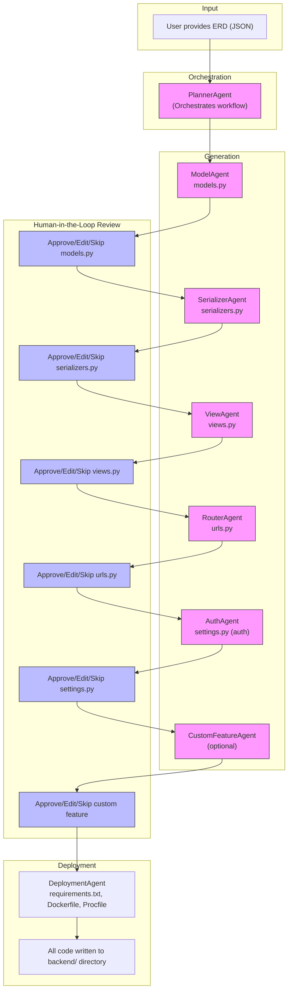

# Agentic Django Backend Generator

This project is an **agentic AI system** that automatically generates a production-ready Django REST API backend from an Entity-Relationship Diagram (ERD) or structured table schema (in JSON format). It leverages OpenRouter (and optionally OpenAI) LLMs to generate, review, and revise code in a modular, extensible, and human-in-the-loop (HITL) workflow.

# 🧠 Agentic Django Backend Generator

An **agentic AI system** that builds a full production-ready **Django REST API backend** from a given Entity-Relationship Diagram (ERD) or JSON-based schema.

Powered by **OpenRouter-compatible LLMs** (e.g., Qwen3 Coder, DeepSeek), this system uses multi-agent collaboration and optional human-in-the-loop (HITL) feedback to generate scalable, deployable code — from models to authentication and deployment scripts.

---

## Features

- Multi-Agent Architecture (models, serializers, views, routers, auth, etc.)  
- OpenRouter LLMs like `Qwen3-Coder`, `DeepSeek`, etc.  
- Automated Code Review and Self-Revision Agent  
- Human-in-the-Loop (HITL) Approval on Each File  
- Natural Language-Based Custom Feature Generation  
- Docker-ready: `Dockerfile`, `requirements.txt`, `Procfile`  
- Sequential or Parallel Agent Execution  
- Rate Limit Handling for OpenRouter APIs  

---

## Output Structure

```bash
backend/
├── models.py
├── serializers.py
├── views.py
├── urls.py
├── settings.py
├── auth/
│   └── custom_auth.py
├── requirements.txt
├── Dockerfile
└── Procfile
```

## Agentic Workflow Diagram

Below is a high-level overview of the agentic workflow used to generate your Django backend:



## Usage

1. **Install dependencies:**
   ```bash
   pip install -r requirements.txt
   ```
2. **Set your OpenRouter API key:**
   ```bash
   export OPENROUTER_API_KEY=your-openrouter-key
   # Optionally set HTTP-Referer and X-Title for OpenRouter rankings
   export OPENROUTER_REFERER=https://your-site-url.example.com
   export OPENROUTER_TITLE=YourSiteName
   ```
3. **Run the agentic backend builder:**
   ```bash
   python agent_backend_builder.py sample_erd.json
   ```
4. **Follow the prompts:**
   - Review, approve, edit, or skip each generated file.
   - Optionally add custom features when prompted.

## Example ERD Input
```json
{
  "User": {
    "name": "CharField",
    "email": "EmailField",
    "has_many": ["Job"]
  },
  "Job": {
    "title": "CharField",
    "description": "TextField",
    "posted_by": "ForeignKey:User"
  }
}
```

## Models Supported
- [x] Qwen3-Coder (qwen/qwen3-coder:free)
- [x] DeepSeek (deepseek/deepseek-r1-0528:free)
- [x] Any OpenRouter-compatible LLM

## Advanced Features
- Modular agent design for easy extension (add new agents for new features)
- Custom Feature Agent for business-specific needs
- Human-in-the-Loop review for enterprise compliance
- Rate limit handling for OpenRouter models

## License
MIT

---

**Build your Django backend, faster, safer, and with full AI + human control!** 