# 🚀 Agentic Django Backend Generator

**Generate complete Django REST API backends from ERD files in minutes, not hours.**

Takes your ERD JSON → AI agents generate → Production-ready Django backend

## ✨ What You Get

- **Complete Django Backend**: Models, Views, Serializers, URLs, Settings
- **Production Ready**: Docker, deployment files, requirements.txt
- **3-5x Faster**: Parallel generation with intelligent caching
- **Smart Review**: Only review files that need attention (80% auto-approved)
- **Error Recovery**: Automatic fallback models and retry logic

---

## 🚀 Quick Start

### **1. Install**
```bash
pip install openai aiofiles
```

### **2. Choose Your Model & Set API Key**
```bash
# Use any model you want!
export OPENROUTER_API_KEY="your_key_here"  # For 300+ models
export OPENAI_API_KEY="your_key_here"      # For GPT models
export ANTHROPIC_API_KEY="your_key_here"   # For Claude models
export GOOGLE_API_KEY="your_key_here"      # For Gemini models
```

### **3. Run with ANY Model**
```bash
# Free models (no cost!)
python universal_backend_builder.py sample_erd.json --model qwen/qwen3-coder:free
python universal_backend_builder.py sample_erd.json --model deepseek/deepseek-r1-0528:free

# Premium models (high quality)
python universal_backend_builder.py sample_erd.json --model gpt-4
python universal_backend_builder.py sample_erd.json --model claude-3-sonnet
python universal_backend_builder.py sample_erd.json --model gemini-pro

# Or use presets
python universal_backend_builder.py sample_erd.json --preset free      # Free models
python universal_backend_builder.py sample_erd.json --preset premium   # Best quality
python universal_backend_builder.py sample_erd.json --preset balanced  # Good + cheap
```

**That's it!** You'll get a complete Django backend in the `backend/` folder.

### **🤖 See All Supported Models**
```bash
python universal_backend_builder.py --list-models
```
Shows 15+ models including FREE ones and premium options from OpenAI, Anthropic, Google, etc.

## 🏢 **For Very Complex ERDs (Enterprise)**

Got a massive ERD with 50+ entities? Use our enterprise-grade system:

### **🔍 Analyze Complexity First**
```bash
python enterprise_backend_builder.py your_massive_erd.json --analyze-only
```

### **🚀 Intelligent Processing**
```bash
# For massive ERDs (automatically detects complexity)
python enterprise_backend_builder.py massive_erd.json --preset enterprise

# Example output:
# 📊 ERD Analysis Complete:
#    • Entities: 37
#    • Relationships: 60  
#    • Complexity Score: 0.49
#    • Recommended Chunks: 2
#    • 🟡 MEDIUM COMPLEXITY - Chunked processing recommended
```

### **🧠 What Makes It Efficient:**

**✅ Smart Chunking**: Breaks massive ERDs into dependency-aware chunks
**✅ Token Optimization**: Minimizes API calls and costs for huge schemas  
**✅ Memory Management**: Handles 100+ entity ERDs without memory issues
**✅ Parallel Processing**: Generates multiple chunks simultaneously
**✅ Dependency Resolution**: Handles complex relationships and circular deps
**✅ Progressive Generation**: Builds incrementally for massive systems

## 📝 ERD Format

```json
{
  "entities": [
    {
      "name": "User",
      "fields": [
        {"name": "id", "type": "AutoField", "primary_key": true},
        {"name": "username", "type": "CharField", "max_length": 150},
        {"name": "email", "type": "EmailField"}
      ]
    }
  ]
}
```  
- Sequential or Parallel Agent Execution  
- Rate Limit Handling for OpenRouter APIs  

---

## Output Structure

```bash
backend/
├── models.py
├── serializers.py
├── views.py
├── urls.py
├── settings.py
├── auth/
│   └── custom_auth.py
├── requirements.txt
├── Dockerfile
└── Procfile
```

## Agentic Workflow Diagram

Below is a high-level overview of the agentic workflow used to generate your Django backend:

```mermaid
flowchart TD
    subgraph Input["🎯 Input Phase"]
        A["User provides ERD (JSON)"]
    end

    subgraph Orchestration["🧠 Orchestration Phase"]
        B["PlannerAgent<br/>(Orchestrates workflow)"]
    end

    subgraph Generation["⚡ Generation Phase"]
        C1["ModelAgent<br/>models.py"]
        C2["SerializerAgent<br/>serializers.py"]
        C3["ViewAgent<br/>views.py"]
        C4["RouterAgent<br/>urls.py"]
        C5["AuthAgent<br/>settings.py (auth)"]
        C6["CustomFeatureAgent<br/>(optional)"]
    end

    subgraph HITL_Review["👤 Human-in-the-Loop Review"]
        D1["✅ Approve/Edit/Skip models.py"]
        D2["✅ Approve/Edit/Skip serializers.py"]
        D3["✅ Approve/Edit/Skip views.py"]
        D4["✅ Approve/Edit/Skip urls.py"]
        D5["✅ Approve/Edit/Skip settings.py"]
        D6["✅ Approve/Edit/Skip custom feature"]
    end

    subgraph Deployment["🚀 Deployment Phase"]
        E["DeploymentAgent<br/>requirements.txt, Dockerfile, Procfile"]
        F["📁 All code written to backend/ directory"]
    end

    A --> B
    B --> C1 --> D1
    D1 --> C2 --> D2
    D2 --> C3 --> D3
    D3 --> C4 --> D4
    D4 --> C5 --> D5
    D5 --> C6 --> D6
    D6 --> E --> F

    %% Professional Styling with High Contrast
    classDef inputNode fill:#e1f5fe,stroke:#01579b,stroke-width:3px,color:#000;
    classDef orchestrationNode fill:#f3e5f5,stroke:#4a148c,stroke-width:3px,color:#000;
    classDef agentNode fill:#e8f5e8,stroke:#1b5e20,stroke-width:3px,color:#000;
    classDef hitlNode fill:#fff3e0,stroke:#e65100,stroke-width:3px,color:#000;
    classDef deployNode fill:#fce4ec,stroke:#880e4f,stroke-width:3px,color:#000;
    
    class A inputNode;
    class B orchestrationNode;
    class C1,C2,C3,C4,C5,C6 agentNode;
    class D1,D2,D3,D4,D5,D6 hitlNode;
    class E,F deployNode;
```



## Usage

1. **Install dependencies:**
   ```bash
   pip install -r requirements.txt
   ```
2. **Set your OpenRouter API key:**
   ```bash
   export OPENROUTER_API_KEY=your-openrouter-key
   # Optionally set HTTP-Referer and X-Title for OpenRouter rankings
   export OPENROUTER_REFERER=https://your-site-url.example.com
   export OPENROUTER_TITLE=YourSiteName
   ```
3. **Run the agentic backend builder:**
   ```bash
   python agent_backend_builder.py sample_erd.json
   ```
4. **Follow the prompts:**
   - Review, approve, edit, or skip each generated file.
   - Optionally add custom features when prompted.

## Example ERD Input
```json
{
  "User": {
    "name": "CharField",
    "email": "EmailField",
    "has_many": ["Job"]
  },
  "Job": {
    "title": "CharField",
    "description": "TextField",
    "posted_by": "ForeignKey:User"
  }
}
```

## Models Supported
- [x] Qwen3-Coder (qwen/qwen3-coder:free)
- [x] DeepSeek (deepseek/deepseek-r1-0528:free)
- [x] Any OpenRouter-compatible LLM

## Advanced Features
- Modular agent design for easy extension (add new agents for new features)
- Custom Feature Agent for business-specific needs
- Human-in-the-Loop review for enterprise compliance
- Rate limit handling for OpenRouter models

## License
MIT

---

**Build your Django backend, faster, safer, and with full AI + human control!** 